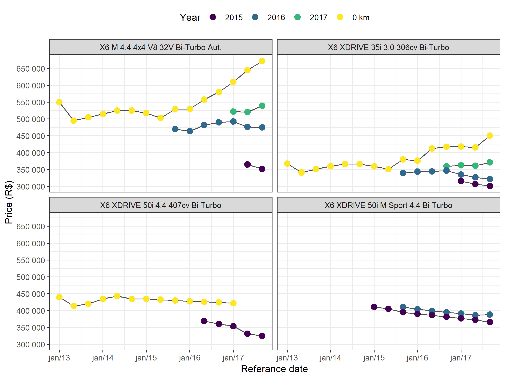
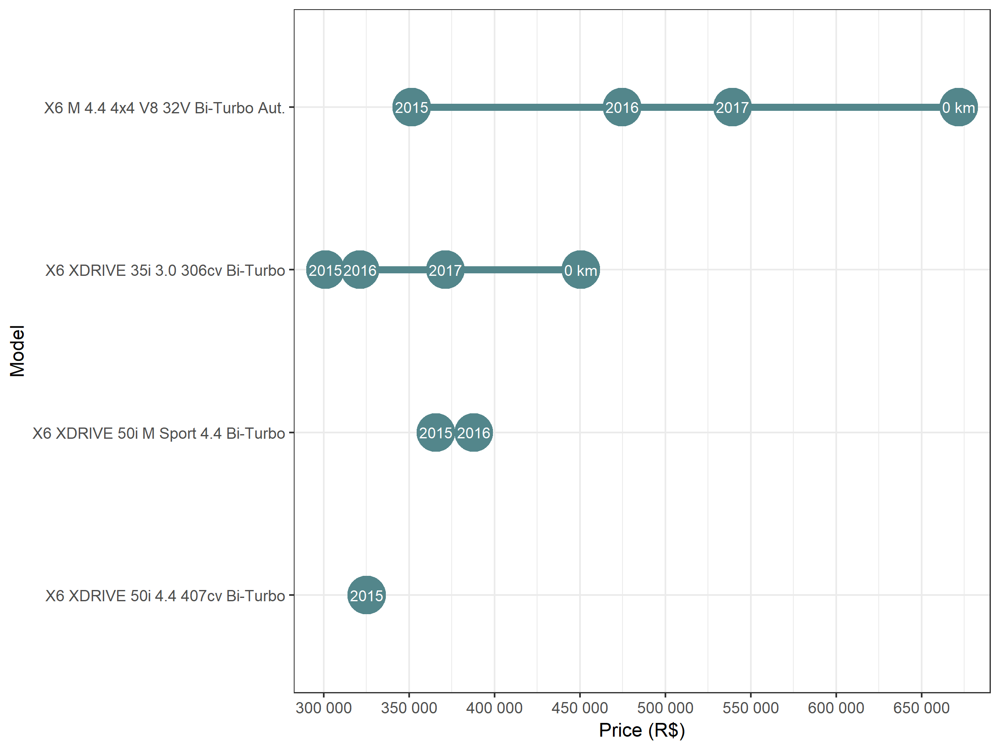

<!-- README.md is generated from README.Rmd. Please edit that file -->

[](https://travis-ci.org/italocegatta/fipe)
[](https://ci.appveyor.com/project/italocegatta/fipe)
[](https://CRAN.R-project.org/package=fipe)
[](https://CRAN.R-project.org/package=fipe)

# fipe

`fipe` is a R package to access [Fipe](https://veiculos.fipe.org.br)’s
average purchase price of vehicles in the Brazilian national market. The
prices are effectively used in purchase negotiations according to
region, vehicle’s conservation, color, accessories or any other factor
that might influence the demand and supply for a specific vehicle. The
year of the vehicle refers to the model year, and the vehicles are not
considered for professional or special use. The values are expressed in
R$ (reais) for each month/year of reference.

## Installation

You can install the development version from github:

``` r
# install.packages('devtools')
devtools::install_github('italocegatta/fipe')
```

The stable version is availabe on [CRAN](https://CRAN.R-project.org)

``` r
install.packages("fipe")
```

## Example

The function `fipe_vehicle` provide access to historical data of
brazilian cars price

``` r
library(fipe)
library(ggplot2)
library(dplyr)

bmw_x6  <- fipe_vehicle(
  model = "x6 ", 
  make = "bmw", 
  year = c(0, 2017:2015),
  date = seq.Date(as.Date("2013-01-01"), as.Date("2017-12-01"), by = "4 months")
)

bmw_x6 
#> # A tibble: 90 x 5
#>    model                             make  year  date        price
#>    <chr>                             <chr> <fct> <date>      <dbl>
#>  1 X6 M 4.4 4x4 V8 32V Bi-Turbo Aut. BMW   0 km  2013-01-01 550000
#>  2 X6 M 4.4 4x4 V8 32V Bi-Turbo Aut. BMW   0 km  2013-05-01 494950
#>  3 X6 M 4.4 4x4 V8 32V Bi-Turbo Aut. BMW   0 km  2013-09-01 504580
#>  4 X6 M 4.4 4x4 V8 32V Bi-Turbo Aut. BMW   0 km  2014-01-01 515000
#>  5 X6 M 4.4 4x4 V8 32V Bi-Turbo Aut. BMW   0 km  2014-05-01 524900
#>  6 X6 M 4.4 4x4 V8 32V Bi-Turbo Aut. BMW   0 km  2014-09-01 524750
#>  7 X6 M 4.4 4x4 V8 32V Bi-Turbo Aut. BMW   0 km  2015-01-01 517157
#>  8 X6 M 4.4 4x4 V8 32V Bi-Turbo Aut. BMW   0 km  2015-05-01 502911
#>  9 X6 M 4.4 4x4 V8 32V Bi-Turbo Aut. BMW   0 km  2015-09-01 529310
#> 10 X6 M 4.4 4x4 V8 32V Bi-Turbo Aut. BMW   0 km  2016-01-01 529937
#> # ... with 80 more rows
```

``` r
bmw_x6 %>%
  ggplot(aes(date, price, color = year, group = year)) +
    geom_line(color = "grey30") +
    geom_point(size = 3) +
    facet_wrap(~model) +
    labs(
      x = "Referance date",
      y = "Price (R$)",
      color = "Year"
    ) +
    scale_y_continuous(breaks = seq(0, 700000, 50000), labels = scales::number) +
    scale_x_date(date_breaks = "1 year", date_labels = "%b/%y") +
    scale_color_viridis_d() +
    theme_bw() +
    theme(legend.position = "top") 
```



``` r
bmw_x6 %>% 
  filter(date == max(date)) %>% 
  mutate(model = reorder(model, price, max)) %>% 
    ggplot(aes(price, model)) +
    geom_line(aes(group = model), color = "cadetblue4", size = 2) +
    geom_point(size = 10, color = "cadetblue4") +
    geom_text(aes(label = year), color = "white", size = 3) +
    labs(
      x = "Price (R$)",
      y = "Model"
    ) +
    scale_x_continuous(breaks = seq(0, 700000, 50000), labels = scales::number) +
    theme_bw()
```


