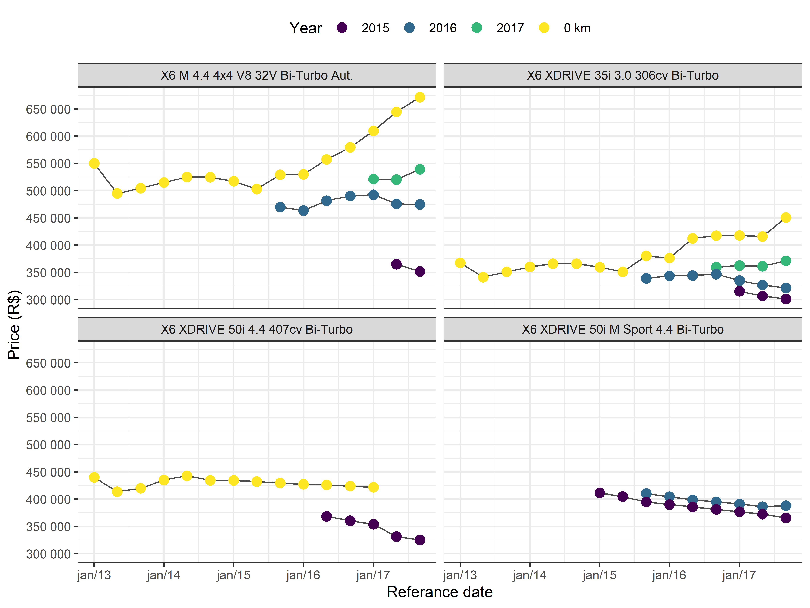

<!-- README.md is generated from README.Rmd. Please edit that file -->
[](https://travis-ci.org/italocegatta/fipe) [](https://ci.appveyor.com/project/italocegatta/fipe) [](https://codecov.io/gh/italocegatta/fipe?branch=master)

fipe
====

O objetivo do pacote `fipe` é facilitar o acesso aos preços médios de veículos no mercado brasileiro disponilizados pela Fundação Instituto de Pesquisas Econômicas (Fipe) atravez da Tabela Fipe. Os valores servem apenas como um parâmetro para negociações ou avaliações. Os preços efetivamente praticados variam em função da região, conservação, cor, acessórios ou qualquer outro fator que possa influenciar as condições de oferta e procura por um veículo específico. O ano do veículo refere-se ao ano do modelo e não são considerados veículos para uso profissional ou especial. Os valores são expressos em R$ (reais) do mês/ano de referência.

Installation
------------

You can install the development version from github:

``` r
# install.packages('devtools')
devtools::install_github('italocegatta/fipe')
```

The stable version is availabe on [CRAN](https://CRAN.R-project.org)

``` r
install.packages("fipe")
```

Example
-------

The function `fipe_vehicle` provide acces to historial data of brazilian cars

``` r
library(fipe)
library(ggplot2)
library(dplyr)

bmw_x6  <- fipe_vehicle(
  model = "x6 ", 
  make = "bmw", 
  year = c(0, 2017:2015),
  date = seq.Date(as.Date("2013-01-01"), as.Date("2017-12-01"), by = "4 months")
)

bmw_x6 
#> # A tibble: 90 x 5
#>    model                             make  year  date        price
#>    <chr>                             <chr> <fct> <date>      <dbl>
#>  1 X6 M 4.4 4x4 V8 32V Bi-Turbo Aut. BMW   0 km  2013-01-01 550000
#>  2 X6 M 4.4 4x4 V8 32V Bi-Turbo Aut. BMW   0 km  2013-05-01 494950
#>  3 X6 M 4.4 4x4 V8 32V Bi-Turbo Aut. BMW   0 km  2013-09-01 504580
#>  4 X6 M 4.4 4x4 V8 32V Bi-Turbo Aut. BMW   0 km  2014-01-01 515000
#>  5 X6 M 4.4 4x4 V8 32V Bi-Turbo Aut. BMW   0 km  2014-05-01 524900
#>  6 X6 M 4.4 4x4 V8 32V Bi-Turbo Aut. BMW   0 km  2014-09-01 524750
#>  7 X6 M 4.4 4x4 V8 32V Bi-Turbo Aut. BMW   0 km  2015-01-01 517157
#>  8 X6 M 4.4 4x4 V8 32V Bi-Turbo Aut. BMW   0 km  2015-05-01 502911
#>  9 X6 M 4.4 4x4 V8 32V Bi-Turbo Aut. BMW   0 km  2015-09-01 529310
#> 10 X6 M 4.4 4x4 V8 32V Bi-Turbo Aut. BMW   0 km  2016-01-01 529937
#> # ... with 80 more rows
```

``` r
bmw_x6 %>%
  ggplot(aes(date, price, color = year, group = year)) +
    geom_line(color = "grey30") +
    geom_point(size = 3) +
    facet_wrap(~model) +
    labs(
      x = "Referance date",
      y = "Price (R$)",
      color = "Year"
    ) +
    scale_y_continuous(breaks = seq(0, 700000, 50000), labels = scales::number) +
    scale_x_date(date_breaks = "1 year", date_labels = "%b/%y") +
    scale_color_viridis_d() +
    theme_bw() +
    theme(legend.position = "top") 
```



``` r
bmw_x6 %>% 
  filter(date == max(date)) %>% 
  mutate(model = reorder(model, price, max)) %>% 
    ggplot(aes(price, model)) +
    geom_line(aes(group = model), color = "cadetblue4", size = 2) +
    geom_point(size = 10, color = "cadetblue4") +
    geom_text(aes(label = year), color = "white", size = 3) +
    labs(
      x = "Price (R$)",
      y = "Model"
    ) +
    scale_x_continuous(breaks = seq(0, 700000, 50000), labels = scales::number) +
    theme_bw()
```


